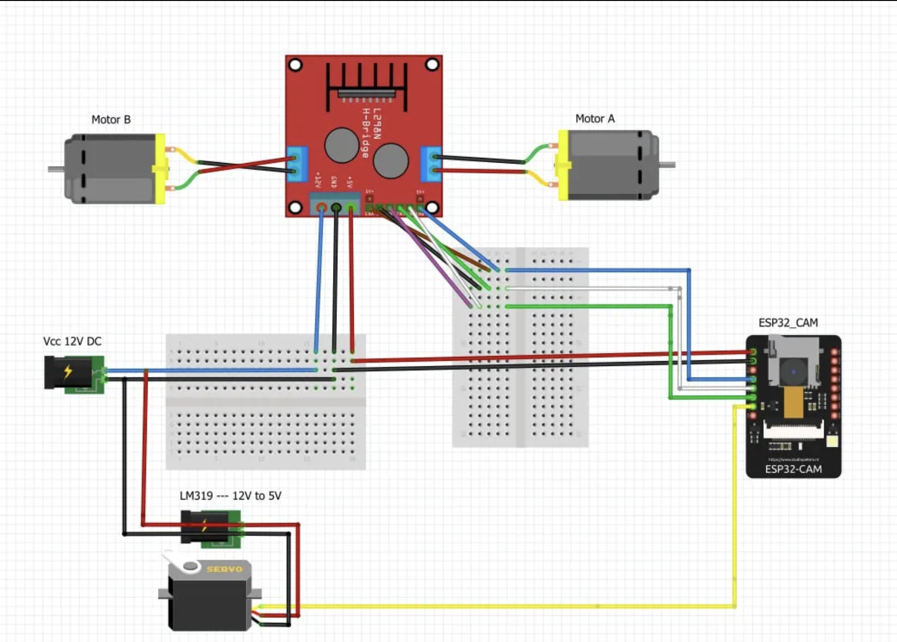

# 🔧 Guía de Montaje de Hardware

## 1. Tabla de Conexiones (Netlist Maestra - Modo Eje Sólido)

**Esta tabla es la FUENTE DE LA VERDAD.** Si el diagrama visual contradice esta tabla, **haz caso a la tabla**.

Para esta configuración, se deben retirar los Jumpers `ENA` y `ENB` del driver L298N y realizar puentes físicos entre los pines de control para unificar la tracción.

| Función Lógica          | Pin ESP32-CAM | Pines L298N (Puenteados) | Descripción Técnica                                    |
| :---------------------- | :------------ | :----------------------- | :----------------------------------------------------- |
| **Velocidad (PWM)**     | **GPIO 13**   | **ENA** + **ENB**        | Control de potencia global. Permite Coasting si PWM=0. |
| **Sentido Avance**      | **GPIO 14**   | **IN1** + **IN3**        | Activa ambos motores hacia adelante.                   |
| **Sentido Retroceso**   | **GPIO 15**   | **IN2** + **IN4**        | Activa ambos motores hacia atrás.                      |
| **Servo Dirección**     | **GPIO 2**    | **Señal PWM**            | Cable Naranja/Amarillo del Servo.                      |
| **Alimentación Lógica** | **Pin 5V**    | **5V Out**               | Alimentación del ESP32 desde el regulador del L298N.   |
| **Tierra Común**        | **Pin GND**   | **GND**                  | **CRÍTICO:** Referencia común de voltaje.              |
| **Reservado**           | **GPIO 12**   | _Desconectado_           | Ver sección de limitaciones abajo.                     |

> ⚠️ **ADVERTENCIA SOBRE GPIO 2 (SERVO):**
> El GPIO 2 está conectado internamente al **LED Flash** de alta potencia del ESP32-CAM.
> Al enviar señales PWM al servo, **el LED parpadeará o se encenderá**, lo cual es normal pero puede ser molesto y generar calor. Si deseas evitar esto, deberás desoldar el LED o taparlo con cinta aislante.

## 1.1 Guía de Unificación de Cables (El "Hack" del Eje Sólido)

Para controlar 4 entradas del L298N con solo 3 pines del ESP32, es necesario duplicar la señal. Existen tres métodos profesionales para lograrlo:

### Opción A: Mini-Protoboard (Recomendada para Prototipos)

Es la opción menos destructiva y más limpia.

1. Colocar el ESP32-CAM en la protoboard.
2. Sacar un cable desde el **GPIO 14** a una línea vacía de la protoboard.
3. Desde esa misma línea, sacar dos cables macho-hembra: uno hacia **IN1** y otro hacia **IN3**.
4. Repetir el proceso para el **GPIO 15** (hacia IN2 e IN4) y el **GPIO 13** (hacia ENA y ENB).

### Opción B: Cables Dupont "Y" (Empalme)

Si no usas protoboard en el chasis:

1. Cortar un extremo de dos cables hembra.
2. Pelar y unir sus puntas de cobre junto con la punta de un cable macho.
3. Soldar la unión y proteger con tubo termorretráctil (o cinta aislante).
   _Resultado:_ Un cable con forma de "Y" (1 Macho al ESP32 -> 2 Hembras al Driver).

### Opción C: Puenteado en el Driver (Soldadura)

Solo para instalaciones permanentes:

1. En la parte inferior del L298N, soldar un pequeño puente de cable entre los pines IN1 e IN3.
2. Hacer lo mismo entre IN2-IN4 y ENA-ENB.
3. Conectar un solo cable desde el ESP32 a cualquiera de los dos pines puenteados.

## 2. Diagrama Visual de Componentes

> ⚠️ **ADVERTENCIA:** La siguiente imagen muestra la ubicación de componentes, pero **LOS CABLES EN LA IMAGEN ESTÁN MAL**. Úsala solo como referencia visual de piezas, pero conecta los cables **según la tabla de arriba**.

### Notas sobre el Driver L298N y Alimentación

- **Batería del Proyecto:** LiPo 3S (11.1V) 2200mAh (Ref: ELL-MAX).
  - _Nota Técnica:_ El uso de una batería de 11.1V (12.6V a plena carga) incrementa la carga térmica del regulador lineal de 5V integrado. Aunque la operación es segura, **se recomienda garantizar una ventilación adecuada** alrededor del disipador térmico para facilitar la disipación pasiva.
- **Alimentación L298N:** Conectar Batería (+) a 12V y Batería (-) a GND.
- **Alimentación ESP32:** Sacar un cable desde el pin **5V** del L298N hacia el pin **5V** del ESP32-CAM.
- **Tierra Común (Ground Loop):** Es OBLIGATORIO tener un cable uniendo el GND del L298N con el GND del ESP32. Sin esto, los pines de control no funcionan.

> ⚠️ **RESTRICCIÓN DE CÓDIGO (FASE A):**
> La reversa está deshabilitada en el firmware base. Si se envían comandos de velocidad negativa (`v < 0`), el sistema registrará un error en consola y aplicará el freno.
> La funcionalidad de reversa solo debe habilitarse en el código fuente (`SolidAxle.cpp`) después de haber implementado la lógica de **Dynamic Dead Time** en el cliente (Paso EXTRA), para prevenir picos de corriente peligrosos al invertir la marcha.

## 3. Resolución de Problemas (Troubleshooting), Limitaciones Técnicas y Reservas de Pines

### A. El ESP32 se reinicia al mover el Servo (Brownout)

El regulador de 5V del L298N puede no ser suficiente para alimentar el WiFi y el Servo simultáneamente.

- **Solución 1 (Fácil):** Conectar un condensador electrolítico (ej. 1000µF / 16V) entre los pines 5V y GND, cerca del ESP32.
- **Solución 2 (Robusta):** Usar un regulador externo (UBEC/Buck Converter) de 5V solo para alimentar el Servo directamente desde la batería, compartiendo solo la tierra (GND) con el resto del sistema.

### B. Modificación de Antena

Para usar la antena externa y optimizar el rango de video:

1. Localizar el conector IPEX junto al módulo metálico.
2. Verificar la resistencia de 0-ohm.
3. **Acción:** Debe estar soldada en la posición que conecta hacia el conector IPEX, deshabilitando la antena de PCB.

### C. Restricción del GPIO 12 (Strapping Pin)

El GPIO 12 determina el voltaje interno de la memoria flash (VDD_SDIO) durante el arranque (Boot).

- **Riesgo:** Si este pin se encuentra en estado ALTO (HIGH) durante el reinicio, el ESP32 configurará el voltaje de flash a 1.8V en lugar de 3.3V, provocando un fallo de arranque ("Flash voltage mismatch").
- **Decisión de Diseño:** En la fase actual (MVP), este pin se deja **DESCONECTADO** para garantizar la estabilidad del sistema y evitar la necesidad de desconectar cables manualmente en cada reinicio.
- **Futuro (I+D):** Se evaluará su uso para implementar un diferencial electrónico en fases avanzadas, considerando circuitos de aislamiento o pull-down externos.
